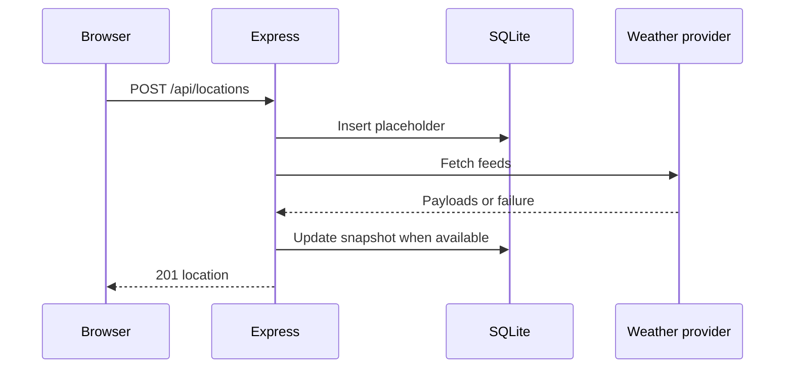

# Backend

Express owns the REST API, SQLite store, and weather integration. In development it mounts Vite middleware; production serves frontend/dist.

```mermaid
flowchart LR
 Browser[React app] -->|relative /api| Express[Express]
 Express --> Routes[/api/locations]
 Express --> Vite[Vite middleware]
 Routes --> DB[(SQLite)]
 Routes --> Weather[SingaporeWeatherClient]
 Weather --> Provider[api-open.data.gov.sg]
```

## Key files

- backend/src/server.ts: app setup, /health, /api/logs, Vite/static serving, and errors.
- backend/src/routes/locations.ts: CRUD routes, validation, and refresh behavior.
- backend/src/weather.ts: provider requests, retries, parsing, and nearest-neighbor matching.
- backend/src/db.ts and schema.ts: Drizzle/SQLite persistence and snapshot shape.

## API

| Method | Route | Behavior |
| --- | --- | --- |
| GET | /health | Returns status healthy. |
| GET | /api/locations | Lists locations, newest first. |
| POST | /api/locations | Validates Singapore coordinates, inserts a placeholder, then attempts weather loading. Returns 201; provider failure still returns the placeholder. |
| GET | /api/locations/:id | Gets one location, or 404. |
| POST | /api/locations/:id/refresh | Replaces its latest weather snapshot; provider failure returns 502. |
| DELETE | /api/locations/:id | Deletes a location, or returns 404. |
| POST | /api/logs | Validates and logs frontend interaction events. |

Coordinates must be numeric and within latitude 1.1–1.5 and longitude 103.6–104.1. Duplicate coordinates return 409. Frontend requests remain relative: no proxy or CORS layer is needed.

## Database

The default database is backend/weather.db; DATABASE_PATH overrides it. Node’s DatabaseSync is used through Drizzle’s sqlite-proxy adapter, with WAL mode enabled. Migrations in backend/drizzle run during initialization.

The locations table stores one latest snapshot per coordinate: scalar readings plus forecast_periods and daily_forecast JSON columns. It is not a historical time-series store.



## Commands

npm run dev, npm test, npm run build, npm run start, npm run doctor, npm run db:generate, npm run db:migrate, and npm run reset.
