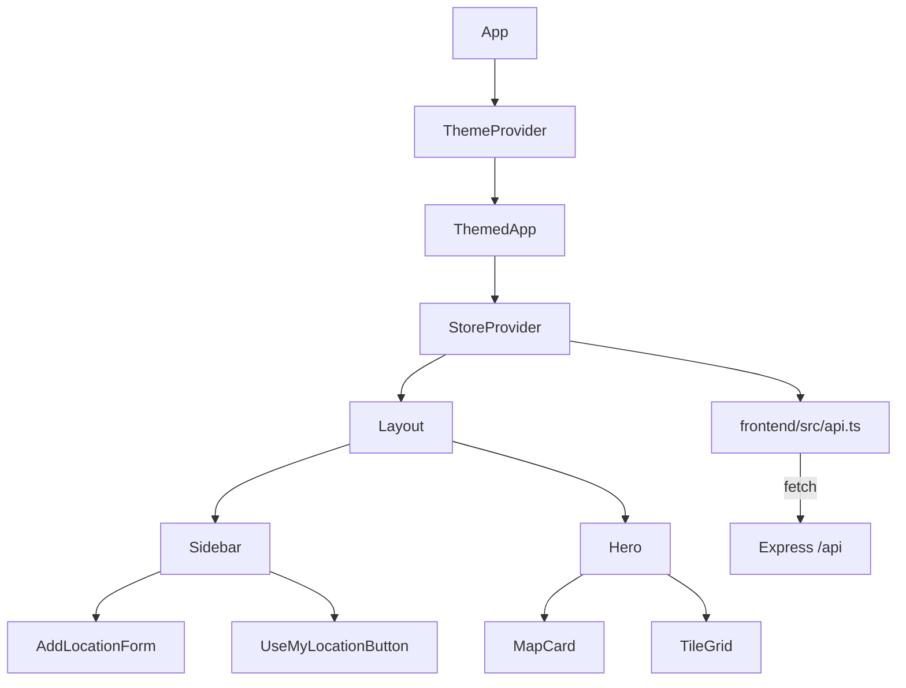
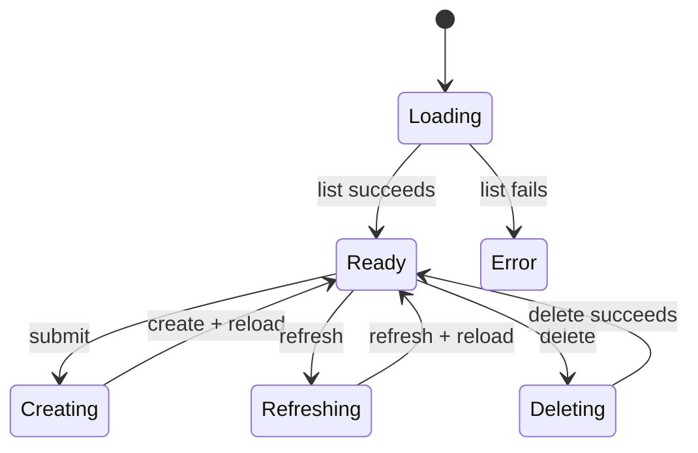

# Frontend

React, Vite, and TypeScript are served by the same Express process. The API layer uses relative /api URLs.

## State

frontend/src/state/store.tsx uses React Context and useState. The store holds locations, selectedId, isAdding, isLoading, refreshingId, error, and actions for select, create, refresh, remove, and loadLocations.

The initial load fetches the complete list. Create and refresh reload the list after the API call. Delete updates local state after the API succeeds and selects the first remaining location when needed. Concurrent loads are deduplicated.

## Components

- Sidebar searches saved locations by area or condition.
- AddLocationForm posts numeric coordinates.
- UseMyLocationButton asks for browser geolocation and selects the nearest saved location using Haversine distance; it does not create one.
- Hero renders the selected condition, forecasts, map, tiles, and refresh action.
- MapCard uses Leaflet markers and CARTO tiles, with fullscreen support.
- HourlyStrip and TenDayForecast render the available forecast arrays; the backend currently provides 24-hour periods and legacy four-day records.
- TileGrid renders condition, air quality, wind, UV, temperature, rainfall, humidity, and daily range.

## Themes and types

themeContext.tsx is separate from the weather store. Theme IDs persist in localStorage under weather-theme and become CSS custom properties such as --bg and --card-bg. types.ts defines Location, WeatherSnapshot, ForecastPeriod, and DailyForecast; nullable weather values represent missing provider feeds.
