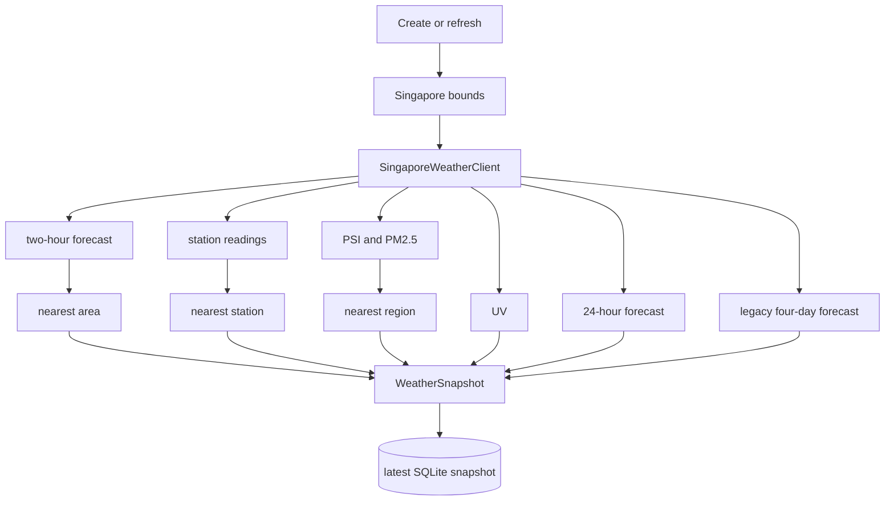
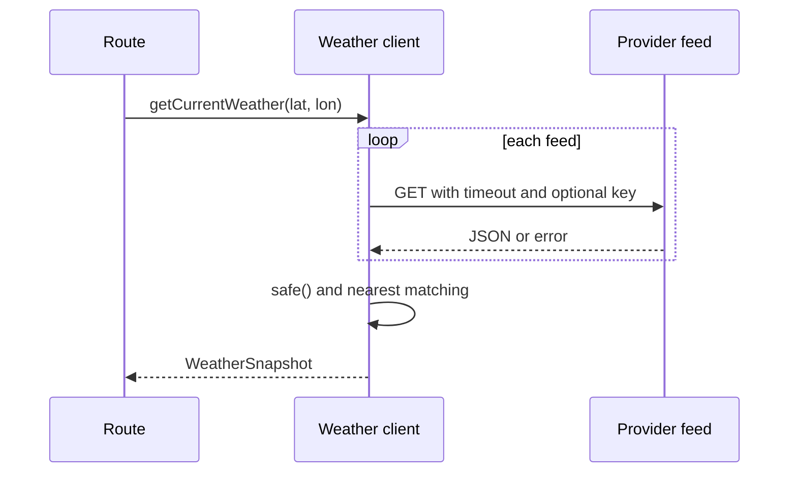

# Weather API integration

backend/src/weather.ts normalizes Singapore feeds from api-open.data.gov.sg into WeatherSnapshot. The legacy four-day forecast uses api.data.gov.sg.

The client attempts two-hr-forecast, air-temperature, relative-humidity, rainfall, wind-speed, wind-direction, uv, psi, pm25, twenty-four-hr-forecast, and 4-day-weather-forecast. The implementation currently awaits these calls sequentially. Each is wrapped in safe(), so one failed feed becomes null while successful feeds remain usable.

## Matching and normalization

Provider arrays are not assumed to be ordered. The nearest candidate minimizes squared coordinate distance:

    (candidateLatitude - requestedLatitude)^2
    + (candidateLongitude - requestedLongitude)^2

Two-hour forecasts choose the nearest named area. Station feeds choose the nearest station that has a numeric latest reading. PSI/PM2.5 choose the nearest region. The 24-hour forecast uses the nearest built-in west, north, central, south, or east region. UV is the latest nationwide value. Timestamps and valid-period text are preserved; invalid numbers become null.

Snapshot fields include condition metadata, temperature/humidity/rainfall/wind/UV, PSI and PM2.5, forecast low/high, forecast_periods[], and daily_forecast[]. Wind is stored in knots and converted to km/h by the frontend.

## Authentication and reliability

Modern feeds use https://api-open.data.gov.sg/v2/real-time/api/; the legacy feed uses https://api.data.gov.sg/v1/environment/4-day-weather-forecast. WEATHER_API_KEY, when configured, is sent only server-side as x-api-key. Requests time out after 8 seconds by default. HTTP 429 retries up to three times with exponential backoff starting at 500ms plus jitter. 401/403, exhausted limits, non-OK responses, and timeouts become WeatherProviderError.

POST /api/locations inserts a Not refreshed row first. A provider failure logs a warning and still returns 201 with that placeholder. Refresh returns 502 for provider failure. Tests should cover bounds, shuffled arrays, partial failures, API-key headers, 429 retries, and duplicate coordinates.
